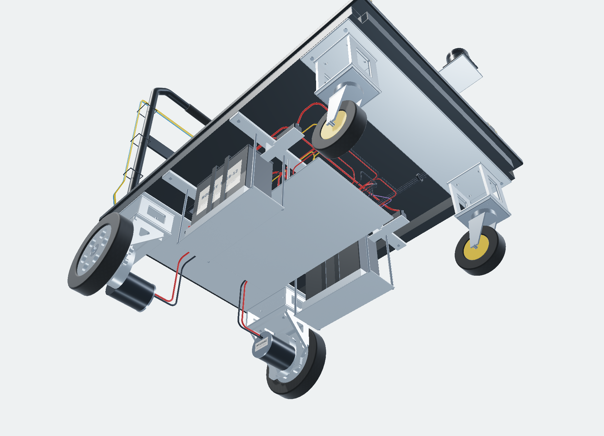

# Smart-Cart-5

[English](README.md) · [3D 조립체](index.html) · [배선·전원](wiring.html) · [제작 메모](docs/BUILD-GUIDE-KR.md)

기성 **900×600mm 접이식 플랫폼 카트**를 바탕으로 만든 제작 검토용 프로토타입 조립체이다. Smart-Cart-4의 전체 프로파일 프레임 대신 원래 차체, 국부 높이 연결대, 하중 분산판과 배터리 가로 보강대를 사용한다. 좌우 하부 납축전지, 두 후륜 모터와 원본 SCMB 브라켓, Raspberry Pi 4B 8GB, 손잡이 비상정지를 포함한다.

> **현재 상태: 실제 솔리드와 배선 경로를 갖춘 프로토타입 통합 모델. 가공·통전 승인 전.**
> V8 규격서의 M 치수를 실측값으로 바꾼 것이 아니다. 모터 외형 충돌, 휠 규격, 원래 차체 체결면, 추가 전장품의 정격은 실물 확인 대상이다. 외관 렌더가 부품 인증·구조 강도·안전성·제작 적합성을 증명하지 않는다.


## 실행

Windows에서는 Python 3가 설치된 상태에서 `start-local.bat`를 실행한다. macOS/Linux는 `./start-local.sh`를 사용한다. 또는 저장소 루트에서 아래 명령을 실행하고 표시된 로컬 주소에 접속한다.

```sh
python -m http.server 8000 --bind 127.0.0.1
```

`index.html`을 파일 탐색기에서 직접 여는 `file://` 방식은 JSON·바이너리 읽기 제한으로 지원하지 않는다. 런타임은 정적 HTML/CSS/JS/데이터 파일만 사용하며 CDN, 계정, API 키, npm 빌드가 필요 없다. GitHub Pages에는 폴더 내용을 저장소 루트에 올리고 루트 배포를 지정한다. 이 패키지 자체가 저장소에 업로드되거나 게시된 것은 아니다.

## 보기와 조작

드래그 회전, 우클릭 또는 Shift+드래그 이동, 휠 확대, 더블클릭 부품 확대를 지원한다. 방향키와 +/-도 사용할 수 있다. ‘하부’ 시점과 음의 고도 회전을 지원하며, 아래에서 관찰할 때 바닥을 자동으로 숨긴다. 다시 위로 회전하면 복원한다. 상판·보호 커버·배선·외장품을 별도로 표시할 수 있다.

GPU가 제공되는 브라우저는 WebGL 2 기반 금속·고무·PCB 재질, 미세 표면 패턴, 그림자와 부품 라벨을 사용한다. WebGL 2 생성에 실패하면 **동일 메시의 깊이 버퍼 기반 Canvas CPU 렌더러**로 전환한다. 이 호환 경로는 정적인 대체 사진이 아니지만 GPU 렌더보다 느리며 재질·그림자가 단순하다.

## CAD와 소스

| 파일 | 용도 |
|---|---|
| `cad/Smart-Cart-5.step` | 단위 mm의 중립 솔리드 조립체. FreeCAD/SolidWorks 가져오기용 |
| `cad/Smart-Cart-5.FCStd` | D5만 들어 있는 색상·가시성 포함 Part::Feature 솔리드 스냅샷 |
| `cad/Load-Smart-Cart-5.FCMacro` | FreeCAD에서 동일 BREP를 직접 불러오고 화면에 맞추는 대체 로더 |
| `cad/SCMB-A01_Bracket.step` | 원래 비대칭 홀 패턴을 유지한 브라켓 단품. 실측·가공 승인 보류 유지 |
| `data/parameters.json` | 근거와 단위를 포함한 설계 기준값 |
| `tools/build_model.py`, `tools/build_release.py` | 실물 치수 반영 및 모델·배선 재생성 소스 |

FCStd는 빈 컨테이너나 메시만 담은 파일이 아니다. 다만 **FreeCAD의 Sketcher/PartDesign 피처 이력을 실행하여 만든 파라메트릭 문서는 아니다.** 형상 변경은 원본 CAD 재생성 코드 또는 CAD의 솔리드 편집으로 진행한다. 모든 배치 좌표가 JSON의 한 값만으로 자동 재설계되는 것은 아니다. 치수를 바꾸면 소스의 관련 배치·배선을 함께 검토하고 검사를 다시 실행한다.

## 핵심 문서

[치수와 미확정 항목](docs/DIMENSIONS-KR.md), [전장 통전 보류 조건](docs/ELECTRICAL-HOLD-KR.md), [근거와 출처](docs/EVIDENCE-KR.md), [검증 범위](docs/QA-KR.md)를 먼저 확인한다. `data/connections.csv`에는 50개 케이블/하네스의 양 끝단, 실제 모델 중심선 길이, 굴곡반경과 가절단 제안이 들어 있다. GPIO/USB 하네스는 묶음 경로이며 구매 PCB의 모든 개별 핀 배선을 확정한 것은 아니다.


