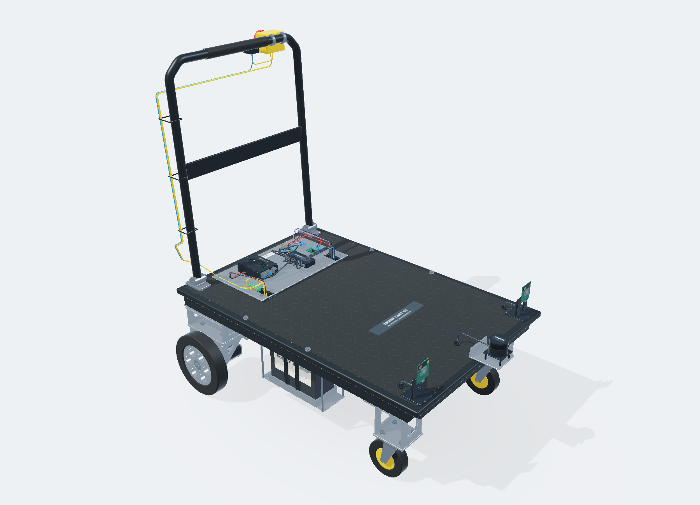

# Smart-Cart-5

[한국어](README-KR.md) · [Assembly viewer](<https://jtech-co.github.io/Smart-Cart-5/>) · [Wiring viewer](wiring.html)

A build-oriented integration model based on a purchased 900 × 600 mm folding platform cart, the supplied V8 component specification, and the original Motor-Bracket/SCMB geometry. Two upright lead-acid batteries sit below the deck, left and right. Rear MY1016Z drives use identical, rigidly rotated SCMB brackets; the controller is a Raspberry Pi 4B 8GB. A handle-mounted NC emergency stop and a separate reset button are included.

**Prototype integration only: dimensional measurement, structural verification and electrical energization remain on hold.** The supplied specification contains unmeasured components. Proposed dimensions and added electrical modules are not presented as purchased-product specifications. The model is not a certified safety system or a production-release drawing.



## Run

Run `start-local.bat` with Python 3 installed, or `./start-local.sh`. Alternatively:

```sh
python -m http.server 8000 --bind 127.0.0.1
```

Serve the repository root. Direct `file://` loading is not supported. The browser runtime is static, with no CDN, account, API key or npm build. The root is suitable for GitHub Pages; no repository has been published by this package.

Drag to orbit, right-drag/Shift-drag to pan, wheel to zoom, double-click to focus. Underside orbit automatically suppresses the ground. WebGL 2 is the primary renderer; a same-mesh depth-buffered Canvas CPU fallback is included for environments without WebGL 2. It is slower and has simplified shading.

## Deliverables

- `cad/Smart-Cart-5.step`: true mm-unit CAD solids, not triangles.
- `cad/Smart-Cart-5.FCStd`: D5-only colored Part::Feature snapshot; no native PartDesign history.
- `cad/Load-Smart-Cart-5.FCMacro`: import the matching BREP files in FreeCAD and fit the view.
- `data/assembly.json`, `geometry.bin`, `connections.csv`: one source for the viewer and 50 routed electrical connections/harnesses.
- `tools/build_release.py`: regenerate geometry, inspect registered cable/solid intersections, and export matching artifacts.

`pip install -r requirements-cad.txt` is needed only for CAD regeneration. Source layout coordinates must be reviewed alongside changed parameters; this is not an automatic routing/structural-optimization system. See the [Korean build guide](docs/BUILD-GUIDE-KR.md) and [QA scope](docs/QA-KR.md).

Native FreeCAD/SolidWorks GUI opening and physical fabrication were not executed. BREP, FCStd payload order and STEP round-trips were checked separately. Browser UI/fallback checks and standalone EGL production-shader renders are distinguished in the QA report.

Original hardware names remain the property of their owners. See [source notices](docs/EVIDENCE-KR.md); this package does not assign a new license to the referenced Motor-Bracket repository.
